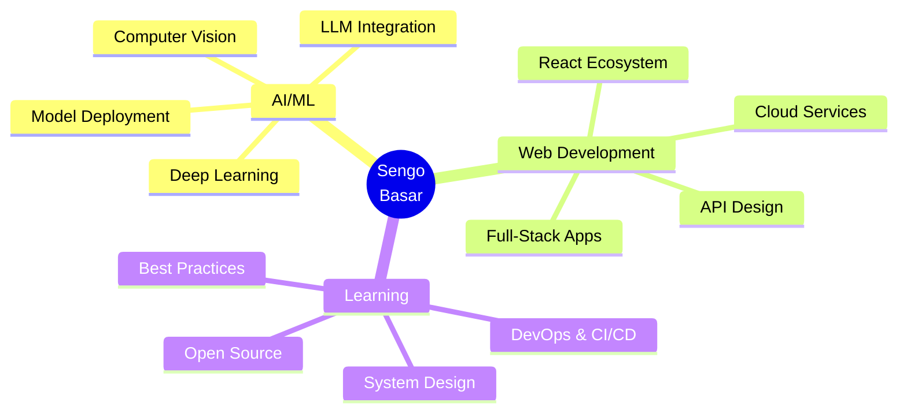

<!-- ===================== HEADER ===================== -->
<div align="center">


<p>
  
</p>

</div>

---

<!-- ===================== QUICK STRIP ===================== -->
<div align="center">


</div>

---

<!-- ===================== ABOUT ME ===================== -->
## 👨‍💻 About Me

```python
class SengoBasar:
    def __init__(self):
        self.name = "Sengo Basar"
        self.role = "AI Engineer & Full-Stack Developer (*self-claimed 😉)"
        self.location = "India 🇮🇳"
        self.education = "BCA Student (2023-2026)"
        
        self.current_focus = [
            "Building AI-powered web applications",
            "Machine Learning model deployment",
            "Open source contributions",
            "Exploring LLMs & Generative AI"
        ]
        
        self.interests = ["AI/ML", "Web Dev", "Cloud", "Open Source"]
    
    def say_hi(self):
        print("Thanks for dropping by! Let's build something amazing together 🚀")

me = SengoBasar()
me.say_hi()
```

---

<!-- ===================== TECH STACK ===================== -->
## 🛠️ Tech Stack & Tools

<table>
  <tr>
    <th width="25%">Category</th>
    <th width="75%">Technologies</th>
  </tr>

  <!-- Languages -->
  <tr>
    <td>
       
      <b>Languages</b>
    </td>
    <td>
      
      
      
      
      
      
    </td>
  </tr>

  <!-- AI/ML -->
  <tr>
    <td>
       
      <b>AI / ML</b>
    </td>
    <td>
      
      
      
      
      
      
    </td>
  </tr>

  <!-- Frontend -->
  <tr>
    <td>
       
      <b>Frontend</b>
    </td>
    <td>
      
      
      
      
      
      
      
    </td>
  </tr>

  <!-- Backend -->
  <tr>
    <td>
       
      <b>Backend</b>
    </td>
    <td>
      
      
      
      
    </td>
  </tr>

  <!-- Databases -->
  <tr>
    <td>
       
      <b>Databases</b>
    </td>
    <td>
      
      
      
    </td>
  </tr>

  <!-- Tools & DevOps -->
  <tr>
    <td>
       
      <b>Tools & DevOps</b>
    </td>
    <td>
      
      
      
      
      
      
    </td>
  </tr>
</table>

---

<!-- ===================== FEATURED PROJECTS ===================== -->
## 🚀 Featured Projects

<div align="center">

<table>
<tr>
<td width="50%">

### 🤖 AI Algorithm Recommender
**Intelligent ML pipeline with Gemini AI**

[](https://github.com/sengobasar/Algorithm-name-recommender)

- 🧠 AI-powered algorithm selection
- 📊 21 ML models with 5-fold CV
- 💬 Natural language explanations
- 🎯 Transparent & educational

**Tech:** Python • Streamlit • Scikit-learn • Gemini AI

</td>
<td width="50%">

### 🌐 Portfolio Website
**Modern, responsive portfolio**

[](https://sengo-portfolio.netlify.app/)

- ⚡ Fast & responsive design
- 🎨 Modern UI/UX
- 📱 Mobile-friendly
- 🚀 Deployed on Netlify

**Tech:** React • Tailwind CSS • JavaScript

</td>
</tr>
</table>

</div>

---

<!-- ===================== GITHUB STATS ===================== -->
## 📊 GitHub Statistics

<div align="center">


</div>

<div align="center" style="margin-top: 20px;">


</div>

---

<!-- ===================== ACTIVITY GRAPH ===================== -->
## 📈 Contribution Graph

<div align="center">


</div>

---

<!-- ===================== DETAILED METRICS ===================== -->
## 🎯 Detailed Metrics

<div align="center">


</div>

<div align="center">
<table>
<tr>
<td width="50%">


</td>
<td width="50%">


</td>
</tr>
<tr>
<td width="50%">


</td>
<td width="50%">


</td>
</tr>
</table>
</div>

---

<!-- ===================== TROPHIES ===================== -->
## 🏆 GitHub Trophies

<div align="center">


</div>

---

<!-- ===================== CURRENT FOCUS ===================== -->
## 🎯 Current Focus

<div align="center">



</div>

---

<!-- ===================== CONNECT ===================== -->
## 🌐 Let's Connect!

<div align="center">

<p>
  <a href="https://sengo-portfolio.netlify.app/" target="_blank">
    
  </a>
  <a href="https://www.linkedin.com/in/sengo-basar-87a14b292" target="_blank">
    
  </a>
  <a href="mailto:sengobasas67@gmail.com">
    
  </a>
  <a href="https://github.com/sengobasar" target="_blank">
    
  </a>
</p>

### 💬 Open for:
🤝 Collaborations • 💼 Freelance Projects • 🎓 Learning Opportunities • 🚀 Open Source Contributions

</div>

---

<!-- ===================== VISITOR COUNT ===================== -->
<div align="center">


<p style="margin-top: 20px;">
  <i>⭐ If you find my work interesting, feel free to star my repositories!</i>
</p>

</div>

---

<!-- ===================== FOOTER ===================== -->
<div align="center">


<p>
  <i>"Building the future, one commit at a time" 🚀</i>
</p>

</div>
